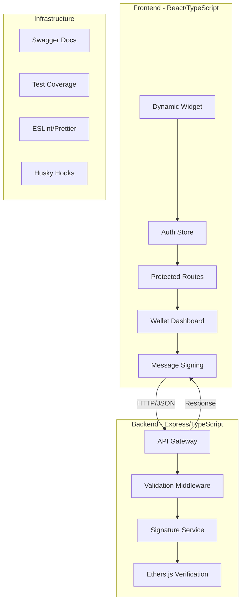

# Dynamic Wallet - Web3 Signature Verification Platform

<div align="center">


A modern, full-stack Web3 application for secure wallet authentication and message signature verification built with React, TypeScript, and Express.

[Features](#features) •
[Quick Start](#quick-start) •
[Architecture](#architecture) •
[API Documentation](#api-documentation) •
[Testing](#testing) •
[Development](#development)

</div>

---

## 🚀 Features

### 🔐 **Secure Authentication**
- **Dynamic Labs Integration** - Seamless wallet connectivity
- **Multi-wallet Support** - MetaMask, WalletConnect, and more
- **Signature Verification** - Cryptographic message validation
- **Session Management** - Persistent authentication state

### 🎨 **Modern UI/UX**
- **Responsive Design** - Mobile-first approach with Tailwind CSS
- **Component Library** - Comprehensive, reusable UI components
- **Interactive Documentation** - Live component showcase
- **Accessibility** - WCAG 2.1 compliant interface

### 🛡️ **Enterprise-Ready**
- **TypeScript** - Full type safety across the stack
- **98%+ Test Coverage** - Comprehensive Jest/Vitest test suites
- **API Documentation** - Interactive Swagger/OpenAPI docs
- **CI/CD Ready** - ESLint, Prettier, Husky git hooks

### ⚡ **Performance & Scalability**
- **Server-side Validation** - Zod schema validation
- **Error Handling** - Comprehensive error boundaries
- **Rate Limiting** - Built-in API protection
- **Production Optimized** - Docker and deployment ready

---

## 🏗️ Architecture



### **Tech Stack**

| Layer | Technology | Purpose |
|-------|------------|---------|
| **Frontend** | React 19, TypeScript, Vite | Modern UI framework with type safety |
| **Styling** | Tailwind CSS, Lucide Icons | Utility-first CSS with consistent icons |
| **State** | Zustand, React Router | Lightweight state management & routing |
| **Backend** | Express, TypeScript | RESTful API with type safety |
| **Validation** | Zod | Runtime type validation |
| **Crypto** | Ethers.js | Ethereum signature verification |
| **Testing** | Jest, Vitest, React Testing Library | Comprehensive test coverage |
| **DevTools** | ESLint, Prettier, Husky | Code quality and consistency |
| **Documentation** | Swagger/OpenAPI | Interactive API documentation |

---

## 🚦 Quick Start

### Prerequisites
- **Node.js** (v18+)
- **npm** or **yarn**
- **Git**

### Installation

```bash
# Clone the repository
git clone <repository-url>
cd legacy-fe-candidate-assignment

# Install dependencies for both projects
npm install

# Install backend dependencies
cd backend && npm install

# Install frontend dependencies
cd ../frontend && npm install
```

> **Note**: The frontend includes a `vercel.json` configuration file for optimal Vercel deployment.

### Environment Setup

**Backend** (`backend/.env`):
```env
PORT=3001
NODE_ENV=development
CORS_ORIGIN=http://localhost:3000
LOG_LEVEL=info
```

**Frontend** (`frontend/.env`):
```env
VITE_API_URL=http://localhost:3001
VITE_DYNAMIC_ENV_ID=your-dynamic-labs-env-id
```

### Development

```bash
# Start backend server (http://localhost:3001)
cd backend && npm run dev

# Start frontend development server (http://localhost:3000)
cd frontend && npm run dev

# Or start both simultaneously from root
npm run dev:backend    # Terminal 1
npm run dev:frontend   # Terminal 2
```

### Production Build

```bash
# Build both applications
npm run build:all

# Start production server
npm run start:prod
```

---

## 📱 Application Features

### **Wallet Connection**
Connect your Web3 wallet using Dynamic Labs' secure widget:
- MetaMask, WalletConnect, Coinbase Wallet support
- Automatic network detection
- Persistent session management

### **Message Signing**
Securely sign and verify messages:
- Input custom messages for signing
- Real-time signature validation
- Transaction history tracking
- Error handling for invalid signatures

### **Dashboard**
Comprehensive wallet management:
- Wallet address display with copy functionality
- Account balance and transaction history
- Network status indicators
- Security settings and preferences

---

## 🔌 API Documentation

### Interactive Documentation
Access the full API documentation at: **http://localhost:3001/api-docs**

### Core Endpoints

#### **POST** `/api/verify-signature`
Verify a cryptographic signature against a message.

**Request Body:**
```json
{
  "message": "Hello, Dynamic Wallet!",
  "signature": "0x742d35cc6634c0532925a3b8d40c4aa86000..."
}
```

**Response:**
```json
{
  "isValid": true,
  "signer": "0x742d35Cc6634C0532925a3b8D40C4aa86000f",
  "originalMessage": "Hello, Dynamic Wallet!",
  "timestamp": 1703123456789
}
```

#### **GET** `/health`
Health check endpoint for monitoring.

**Response:**
```json
{
  "status": "ok",
  "timestamp": "2023-12-21T10:30:45.123Z"
}
```

### Error Handling
All API endpoints return standardized error responses:

```json
{
  "error": "Validation failed",
  "code": "VALIDATION_ERROR",
  "statusCode": 400,
  "details": [
    {
      "field": "signature",
      "message": "Invalid signature format"
    }
  ]
}
```

---

## 🧪 Testing

### **Coverage Summary**
- **Backend**: 98.48% statements, 90% functions
- **Frontend**: Comprehensive component and hook testing
- **Integration**: Full API endpoint coverage

### **Running Tests**

```bash
# Run all tests
npm run test

# Backend tests with coverage
cd backend && npm run test:coverage

# Frontend tests with coverage
cd frontend && npm run test:coverage

# Watch mode for development
npm run test:watch
```

### **Test Structure**

```
backend/src/__tests__/
├── config/           # Configuration testing
├── middleware/       # Express middleware tests
├── routes/          # API endpoint integration tests
├── services/        # Business logic unit tests
└── utils/           # Utility function tests

frontend/src/
├── hooks/__tests__/  # Custom hook testing
├── components/       # React component tests
└── test/            # Test utilities and setup
```

### **Testing Philosophy**
- **Unit Tests**: Individual functions and components
- **Integration Tests**: API endpoints and component interactions
- **End-to-End**: Critical user flows and workflows
- **Coverage Goals**: Maintain 80%+ coverage across all modules

---

## 🛠️ Development

### **Code Quality Standards**

#### **ESLint Configuration**
- TypeScript-first linting rules
- React best practices enforcement
- Import order and unused variable detection
- Consistent code style across frontend/backend

#### **Prettier Formatting**
- Automatic code formatting on save
- Consistent indentation and spacing
- Import organization and sorting

#### **Git Hooks (Husky)**
- **Pre-commit**: Format and lint all staged files
- **Pre-push**: Run test suites before pushing
- **Commit-msg**: Conventional commit message format

### **Development Scripts**

```bash
# Linting and formatting
npm run lint          # Check all projects
npm run lint:fix      # Auto-fix linting issues
npm run format        # Format all code

# Development servers
npm run dev:frontend  # Start frontend dev server
npm run dev:backend   # Start backend dev server
npm run dev:docs      # Start backend with API docs

# Testing and coverage
npm run test         # Run all test suites
npm run test:watch   # Watch mode for development
npm run test:ci      # CI/CD test runner
```

### **Project Structure**

```
legacy-fe-candidate-assignment/
├── backend/                 # Express.js API server
│   ├── src/
│   │   ├── config/         # Configuration management
│   │   ├── middleware/     # Express middleware
│   │   ├── routes/         # API route definitions
│   │   ├── services/       # Business logic
│   │   ├── types/          # TypeScript type definitions
│   │   ├── utils/          # Utility functions
│   │   └── __tests__/      # Test suites
│   ├── jest.config.js      # Jest testing configuration
│   └── eslint.config.js    # ESLint rules
├── frontend/               # React application
│   ├── src/
│   │   ├── components/     # Reusable UI components
│   │   ├── features/       # Feature-based modules
│   │   ├── hooks/          # Custom React hooks
│   │   ├── lib/            # External API clients
│   │   ├── router/         # React Router setup
│   │   ├── stores/         # Zustand state stores
│   │   ├── types/          # TypeScript definitions
│   │   └── utils/          # Helper functions
│   ├── vitest.config.ts    # Vitest testing setup
│   └── tailwind.config.js  # Tailwind CSS config
├── .husky/                 # Git hooks configuration
└── package.json            # Root workspace configuration
```

---

## 🚀 Deployment

### **Production Checklist**
- [ ] Environment variables configured
- [ ] Database connections established
- [ ] API rate limiting enabled
- [ ] HTTPS certificates installed
- [ ] Error monitoring configured
- [ ] Backup strategies implemented

```

### **Environment Variables**

#### **Required for Production**
```env
# Backend
NODE_ENV=production
PORT=3001
CORS_ORIGIN=https://your-domain.com
LOG_LEVEL=warn

# Frontend
VITE_API_URL=https://api.your-domain.com
VITE_DYNAMIC_ENV_ID=your-production-env-id
```

### **Vercel Deployment**

#### **Frontend Deployment**
1. **Connect Repository** to Vercel
2. **Set Root Directory** to `frontend`
3. **Environment Variables** in Vercel Dashboard:
   ```
   VITE_API_URL=https://your-backend-url.com
   VITE_DYNAMIC_ENV_ID=your-dynamic-labs-environment-id
   ```
4. **Deploy** - Vercel auto-detects Vite configuration

#### **Backend Deployment Options**
- **Railway** - Easy Node.js deployment
- **Render** - Free tier with existing `render.yaml`
- **Fly.io** - Global deployment platform
- **DigitalOcean App Platform** - Container-based deployment

#### **Custom Domain Setup**
1. Add domain in Vercel dashboard
2. Update DNS records to point to Vercel
3. SSL certificates auto-generated
4. Update CORS settings in backend with new domain

---

## 🔮 Potential Improvements

Here are practical enhancements that could be added to this Dynamic Wallet project:

### **🎨 UI/UX Enhancements**
- [ ] **Dark Mode Toggle** - Add theme switching in user preferences
- [ ] **Mobile Responsiveness** - Improve mobile layout and touch interactions
- [ ] **Loading States** - Better skeleton loaders and progress indicators
- [ ] **Toast Notifications** - Success/error messages for user actions
- [ ] **Keyboard Navigation** - Full keyboard accessibility support
- [ ] **Copy to Clipboard** - One-click copy for addresses and signatures

### **🔐 Security & Validation**
- [ ] **Message Templates** - Pre-defined message formats for common use cases
- [ ] **Signature Expiry** - Time-based signature validation
- [ ] **Rate Limiting UI** - Show API limits and usage to users
- [ ] **Input Sanitization** - Enhanced XSS protection for message inputs
- [ ] **Session Timeout** - Auto-logout after inactivity
- [ ] **Signature History** - Local storage of previous signed messages

### **📊 Enhanced Functionality**
- [ ] **Export Features** - Download signature history as CSV/JSON
- [ ] **Message Search** - Search through signed message history
- [ ] **Bulk Operations** - Sign multiple messages at once
- [ ] **Message Validation** - Real-time validation before signing
- [ ] **QR Code Support** - Generate QR codes for messages/signatures
- [ ] **Message Categories** - Organize messages by type or purpose

### **🛠️ Developer Experience**
- [ ] **API Playground** - Interactive API testing interface in Swagger
- [ ] **Code Examples** - Add more language examples to API docs
- [ ] **Error Codes** - Comprehensive error code documentation
- [ ] **Webhook Simulator** - Test webhook endpoints from the UI
- [ ] **API Logs** - View recent API calls and responses
- [ ] **SDK Examples** - JavaScript client library with examples

### **📈 Performance & Monitoring**
- [ ] **Caching** - Add Redis for API response caching
- [ ] **Database** - Add PostgreSQL for persistent data storage
- [ ] **Error Tracking** - Integrate Sentry for error monitoring
- [ ] **Analytics** - Add Google Analytics or Mixpanel
- [ ] **Health Dashboard** - Real-time system status page
- [ ] **API Metrics** - Response time and usage analytics

### **🔧 Configuration & Deployment**
- [ ] **Environment Configs** - Better environment variable management
- [ ] **Docker Compose** - Complete containerized development setup
- [ ] **GitHub Actions** - Automated testing and deployment
- [ ] **Vercel Deployment** - One-click deployment configuration
- [ ] **SSL/HTTPS** - Production-ready SSL configuration
- [ ] **Backup Scripts** - Automated backup and restore procedures

### **🧪 Testing Improvements**
- [ ] **E2E Tests** - Playwright tests for critical user flows
- [ ] **API Integration Tests** - Test real API endpoints with test data
- [ ] **Visual Testing** - Screenshot comparison tests
- [ ] **Performance Tests** - Load testing for API endpoints
- [ ] **Accessibility Tests** - Automated a11y testing
- [ ] **Cross-browser Testing** - Ensure compatibility across browsers

### **📱 Additional Features**
- [ ] **PWA Support** - Make the app installable as PWA
- [ ] **Offline Mode** - Basic functionality when offline
- [ ] **Multi-language** - i18n support for different languages
- [ ] **User Preferences** - Save user settings and preferences
- [ ] **Help System** - In-app tutorials and help documentation
- [ ] **Feedback System** - User feedback collection and support

### **🔄 API Enhancements**
- [ ] **API Versioning** - v2 API with backward compatibility
- [ ] **Batch Endpoints** - Process multiple signatures at once
- [ ] **Async Processing** - Background job processing for heavy tasks
- [ ] **File Upload** - Support for signing file hashes
- [ ] **WebSocket Support** - Real-time updates and notifications
- [ ] **API Key Management** - User-generated API keys for developers

---

## 🤝 Contributing

### **Development Workflow**
1. **Fork** the repository
2. **Create** a feature branch (`git checkout -b feature/amazing-feature`)
3. **Commit** your changes (`git commit -m 'Add amazing feature'`)
4. **Push** to the branch (`git push origin feature/amazing-feature`)
5. **Open** a Pull Request

### **Code Standards**
- Follow TypeScript best practices
- Maintain test coverage above 80%
- Use conventional commit messages
- Update documentation for new features

### **Pull Request Template**
- [ ] Tests added/updated for new functionality
- [ ] Documentation updated
- [ ] Linting and formatting checks pass
- [ ] Breaking changes documented

---

## 📄 License

---

## 🔗 Links

- **Live Demo**: [https://dynamic-wallet-demo.vercel.app](https://dynamic-wallet-demo.vercel.app)
- **API Documentation**: [https://api.dynamic-wallet.com/docs](https://api.dynamic-wallet.com/docs)
- **Component Library**: [http://localhost:3000/components](http://localhost:3000/components)
- **Dynamic Labs**: [https://dynamic.xyz](https://dynamic.xyz)

---

<div align="center">

**Built with ❤️ by [@furqancodes](https://github.com/furqancodes)**

[⬆ Back to Top](#dynamic-wallet---web3-signature-verification-platform)

</div>

